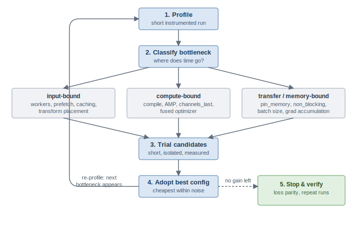
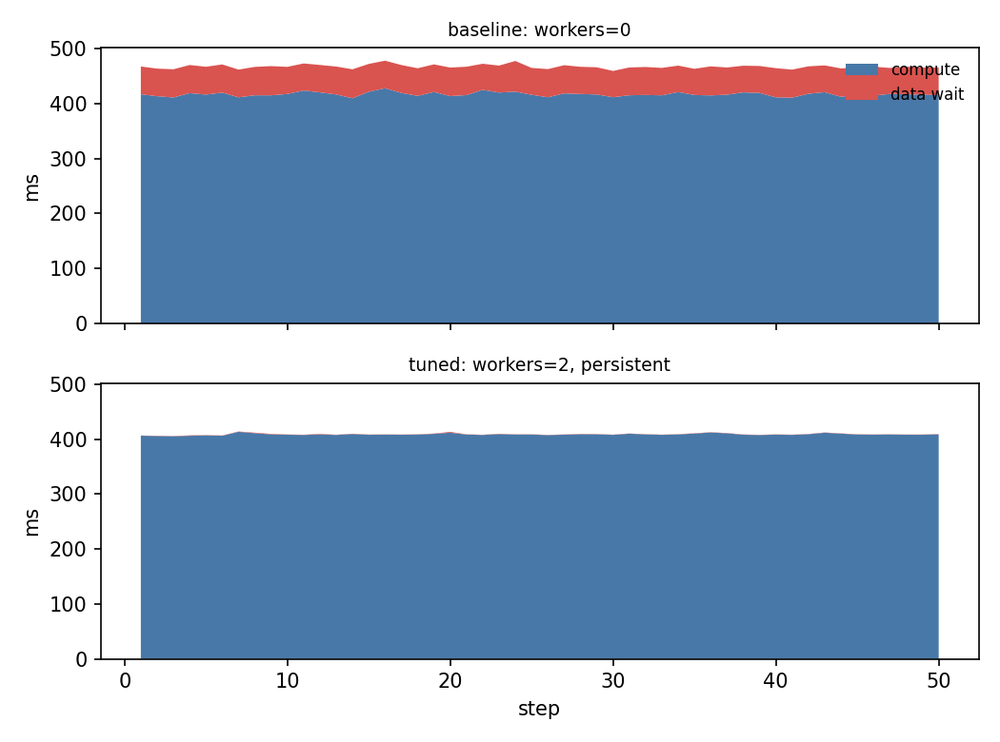

# loadtune

**Agentic profiler & tuner for PyTorch workloads — every recommendation is a measured experiment, not a suggestion.** loadtune profiles your training loop, splits every step into *data wait* vs *compute*, diagnoses input-pipeline bottlenecks, and runs short isolated experiments to find a better config — for example proposing `num_workers=2` instead of `num_workers=4` when the extra workers are pure overhead.

loadtune works in two modes:

- **CLI tool** — run `loadtune profile` and `loadtune tune` from your terminal for fast, deterministic, local-first results.
- **AI Agent Skill** — drop the built-in [`SKILL.md`](skills/loadtune/SKILL.md) into Claude Code or Google Antigravity and let an LLM autonomously diagnose and fix your PyTorch bottlenecks in a single prompt.

## How it works

```
baseline profile ──▶ heuristic rules ──▶ trials ──▶ report
     │                                     │
     │                                     │
     │                           each trial runs in a
     │                           fresh subprocess for
     └─ data-wait vs compute split, clean measurements
        CPU util, step-time percentiles
```

Every proposed config is **verified by measurement**, never just suggested. The report shows throughput per trial, speedup vs baseline, why each config was tried, and charts of where each step's time goes.

## The tuning methodology



Many knobs can affect training throughput, but searching their joint space is intractable and unnecessary. loadtune follows a **bottleneck-driven loop** instead:

1. **Profile** — a short instrumented run splits every step into *data wait* (accelerator idle) vs *compute*.
2. **Classify the bottleneck** — input-bound, compute-bound, or transfer/memory-bound. Only the matching knob family enters the search; tuning `torch.compile` on an input-bound job is wasted effort.
3. **Trial candidates** — short, subprocess-isolated runs measure each proposal. Within a family, independent knobs get coordinate descent; interacting knobs (e.g. `num_workers` × intra-op threads) are trialed jointly — where the LLM brain prunes the grid by reasoning about the hardware.
4. **Adopt the cheapest config within noise tolerance** of the best throughput — `num_workers=2` beats `num_workers=8` when they're statistically tied.
5. **Re-profile and repeat** — removing one bottleneck exposes the next (a job that was 49% input-bound becomes compute-bound once workers saturate the pipeline). Stop when expected gain no longer justifies trial cost. Math-preserving knobs need only throughput; semantics-changing knobs (batch size, AMP) additionally gate on a fixed-step loss-parity check.

v0.1 implements one iteration of this loop for the input-pipeline knob family; further families and multi-round tuning are on the roadmap.

## Install

```bash
pip install -e ".[vision]"        # core + torchvision workloads
pip install -e ".[all]"           # all workloads + tests
```

## Quickstart (no downloads needed)

```bash
# 1. Profile the deliberately input-bound synthetic workload
loadtune profile workloads/synthetic_bottleneck.py --steps 50

# 2. Let the agent tune it
loadtune tune workloads/synthetic_bottleneck.py --steps 50 --out report.md
```

Then the real one:

```bash
loadtune tune workloads/resnet50_cifar.py --steps 100 --out resnet_report.md
```

## Results (Phase 1: Apple M2 Pro, 10 cores, MPS)

**Synthetic input-bound workload** (small CNN, deliberately heavy CPU augmentation) — the stress case:

| | baseline `workers=0` | tuned `workers=2` |
|---|---|---|
| throughput | 4,017 samples/s | **8,479 samples/s (2.11x)** |
| data wait | 48% of step time | 2.6% |

*(medians of 3 runs; full spreads in [results/synthetic_repeats.md](results/synthetic_repeats.md))*

**ResNet-50 on CIFAR-10** (224px, heavy augmentation) — the realistic case:

| | baseline `workers=0` | tuned `workers=2` |
|---|---|---|
| throughput | 68.4 samples/s | **78.2 samples/s (1.14x)** |
| data wait | 10.8% of step time | 0.1% |

The ResNet result is the validating one: the profile measured an 11% data-wait fraction, which bounds the input-side speedup at ~1.12x — the agent proposed a single cheap trial, claimed the full ceiling, and stopped instead of sweeping knobs that cannot help.



*The red band is time the accelerator spends idle, waiting for data. Two DataLoader workers remove it entirely; what remains is pure compute.*

A replication note: on the synthetic workload, single-trial differences between configs on the ~8,500 samples/s plateau did not replicate — with `--repeats 3`, all configs beyond `workers=2` have overlapping spreads, and an apparent thread-contention effect from a single early run turned out to be noise. The verdict logic therefore picks the cheapest statistically-tied config, and headline numbers come from repeated measurements.


Add `--html` to any tune run to also get a self-contained interactive report (hover tooltips, spread bars from `--repeats`) you can share as a single file.

## Writing your own workload

A workload is one Python file with a `get_workload()` function — loadtune owns the DataLoader so it can tune it; you supply dataset, model, and a train step:

```python
from loadtune import Workload

def get_workload() -> Workload:
    return Workload(
        name="my_model",
        make_dataset=...,            # () -> Dataset
        make_model=...,              # () -> nn.Module
        make_optimizer=...,          # (model) -> Optimizer
        train_step=...,              # (model, opt, batch, device) -> loss
        default_batch_size=32,
    )
```

## Knobs tuned in v1

`num_workers`, `prefetch_factor`, `persistent_workers`, `pin_memory` (CUDA only — it's a no-op on Apple Silicon's unified memory), `num_threads` (intra-op threads, trialed jointly with worker counts since they compete for cores), `compile` (`torch.compile`), `amp` (Automatic Mixed Precision), `non_blocking` (asynchronous copies to CUDA device), and optionally `batch_size`.

The heuristic brain's rules, beyond the worker sweep: a **CPU-saturation guard** (input-bound + cores maxed → more workers can't help; the diagnosis says so instead of proposing futile trials), a **jitter rule** (p90/p50 step time ≥ 1.5 with active workers → deeper prefetch to absorb stragglers), **worker×thread pairing** (4+ workers → paired trial capping main-process intra-op threads to the leftover cores), **AMP and compilation** rules when compute-bound, and **asynchronous memory transfers** validation on CUDA machines with pinned memory.

All configurations that alter precision or execute dynamic optimizations are validated against a **Loss Parity Check** to ensure mathematical and convergence correctness before recommendations are finalized.

## Advanced Usage

`loadtune` supports several advanced flags to streamline your tuning experience:

- **Auto-Apply (`--apply`)**: Automatically generates a `loadtune_apply.py` code snippet containing the best configuration found. You can easily import this into your project.
- **Fast Mode (`--fast`)**: Runs tuning trials in-process instead of spawning fresh Python subprocesses. This drastically reduces trial startup overhead for workloads with massive models or datasets, but sacrifices some memory isolation.
- **Multi-Round Tuning (`--max-rounds N`)**: Automatically repeats the tuning loop. If an input-bound bottleneck is removed, `loadtune` will profile again to catch shifting bottlenecks.
- **Repeats (`--repeats N`)**: Measure each configuration N times. The tool will report the median throughput with min-max spread, filtering out system noise.

## Use as an AI Agent Skill (Claude Code & Antigravity)

`loadtune` is designed to be fully compatible with AI assistants that support native CLI interactions, meaning you can plug it directly into agents like Claude Code or Google Antigravity to act as an autonomous performance engineering skill.

### Why use this?
Instead of manually writing verbose PyTorch profiler code, guessing `num_workers` values, and staring at unreadable JSON traces, you can simply point your AI assistant at your codebase and ask: *"Why is my PyTorch script training so slowly?"*

The AI will use `loadtune` to:
1. **Diagnose**: Automatically run the script and mathematically prove if your GPU is starving due to a data-wait bottleneck.
2. **Cure**: Propose isolated trial experiments (e.g., testing 2 vs. 4 vs. 8 workers via the `--knobs` flag), run them in the background to measure exact throughput, and rewrite your code with the winning configuration.

A 3-hour hardware debugging chore reduced to a single prompt!

### Installation

The prompt instructions that teach AI agents how to use `loadtune` are located in [`skills/loadtune/SKILL.md`](skills/loadtune/SKILL.md). 

**For Claude Code:**
You can just ask Claude to read the skill instructions before attempting optimizations:
```bash
claude "Read skills/loadtune/SKILL.md and then optimize my workloads/resnet50_cifar.py script."
```

**For Google Antigravity:**
Antigravity supports global skills. You can simply copy the skill to your Antigravity config directory:
```bash
mkdir -p ~/.gemini/config/skills/loadtune
cp skills/loadtune/SKILL.md ~/.gemini/config/skills/loadtune/SKILL.md
```
Then, Antigravity will automatically understand how to use `loadtune` whenever you ask it to profile or tune PyTorch workloads.

## Troubleshooting

- **Out of Memory (OOM) during trials:** If a trial proposes `num_workers=8` and crashes, `loadtune` will gracefully catch the `-9` SIGKILL signal and mark the trial as an OOM failure. It will automatically fallback to cheaper configurations.
- **Apple Silicon (MPS) vs CUDA:** On Apple Silicon, unified memory means `pin_memory` is a no-op, and CPU-side augmentations directly compete with the GPU for memory bandwidth. MPS workloads will often see larger gains from dataloader tuning.
- **Slow Trial Startup:** If you notice trials taking too long to start, use the `--fast` flag, or ensure your datasets and models are pre-downloaded to avoid downloading them during every isolated subprocess.

## Notes for Apple Silicon (MPS)

Developed on an M2 Pro. Data-wait measurements use `torch.mps.synchronize()` so compute timings are honest. CPU-side augmentation competes with the GPU for unified-memory bandwidth, which makes dataloader bottlenecks *more* pronounced on Macs — and the wins correspondingly larger. AMP and `torch.compile` knobs are out of scope on MPS for now (limited backend support).

## Roadmap

- [x] Phase 1: input-pipeline tuning on Apple Silicon, validated on synthetic + ResNet-50/CIFAR-10 (see [Results](#results-phase-1-apple-m2-pro-10-cores-mps))
- [x] Repeated measurements: `--repeats N` reports median throughput with min–max spread
- [x] Heuristic vs LLM brain comparison, incl. ceiling-aware trial budgeting in the LLM prompt
- [x] Joint knobs, first instance: `num_workers` × `torch.set_num_threads`
- [x] Interactive HTML report (`--html`)
- [ ] Phase 2: NVIDIA DeepLearningExamples on cloud GPUs — agent vs expert-tuned configs
- [x] Compute-bound family: AMP, `torch.compile`, `channels_last`, fused optimizers (CUDA)
- [x] Multi-round tuning (`--max-rounds`)
- [x] `non_blocking` copies knob (CUDA, pairs with pin_memory)
- [x] Accuracy-parity check (fixed-step loss comparison) for semantics-changing knobs
- [x] Persist raw trial data (`--save-raw`) so reports can be regenerated without re-running
- [x] Auto-apply (`--apply` generates a configuration snippet)

## License

MIT
