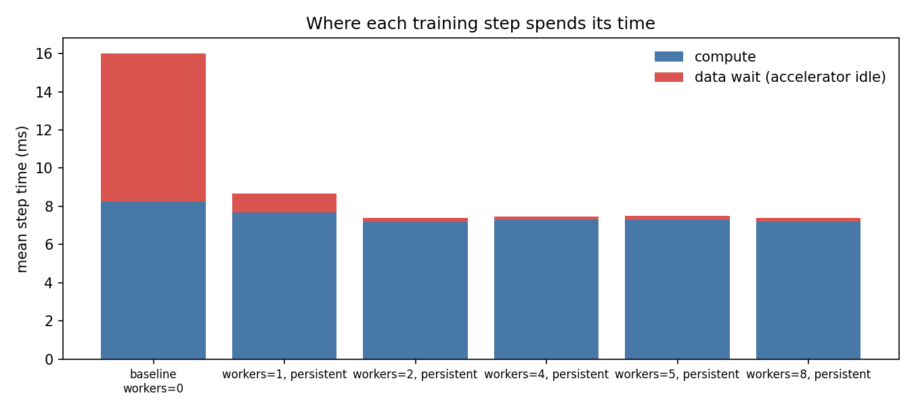
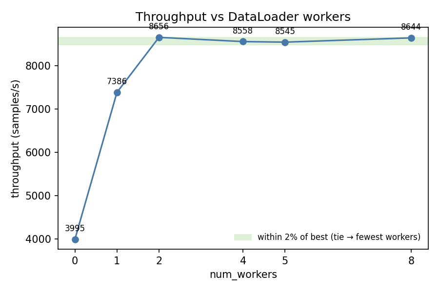
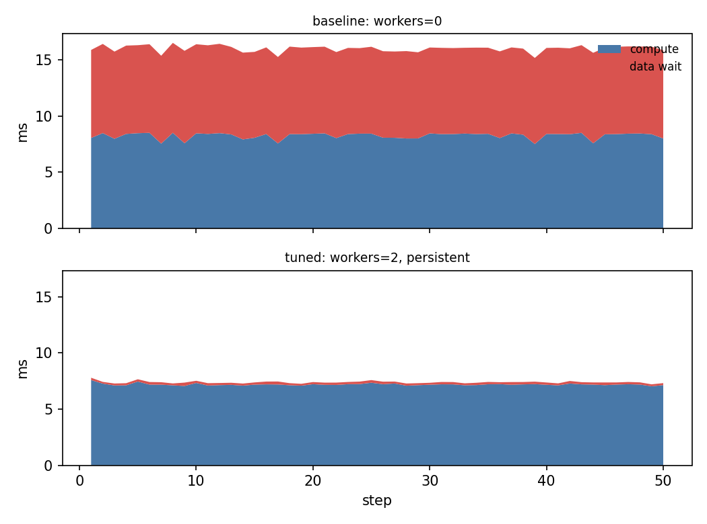

# loadtune report — synthetic_bottleneck

*2026-06-11 22:06 · device `mps` · 10 CPUs · brain `heuristic`*

## Diagnosis

The workload is **input-bound**: 48% of step time is spent waiting for the DataLoader. Mean CPU utilisation during the run was 9.0%.

## Baseline

- config: `workers=0`
- throughput: **3995.4 samples/s**
- data wait: 48.5% of step time (0.39s of 0.80s over 50 steps)
- step time p50/p90: 16.1 / 16.4 ms
- dataloader startup: 0.00s

## Trials

| config | throughput (samples/s) | vs baseline | data wait | proposed because |
|---|---|---|---|---|
| `workers=1, persistent` | 7385.5 | 1.85x | 11.5% | data_wait_frac=48% ≥ 20%: input-bound, trying num_workers=1 |
| `workers=2, persistent` | 8655.9 | 2.17x | 2.7% | data_wait_frac=48% ≥ 20%: input-bound, trying num_workers=2 |
| `workers=4, persistent` | 8558.4 | 2.14x | 2.8% | data_wait_frac=48% ≥ 20%: input-bound, trying num_workers=4 |
| `workers=5, persistent` | 8545.4 | 2.14x | 2.6% | data_wait_frac=48% ≥ 20%: input-bound, trying num_workers=5 |
| `workers=8, persistent` | 8643.8 | 2.16x | 2.5% | data_wait_frac=48% ≥ 20%: input-bound, trying num_workers=8 |

## Charts

## Verdict

**Recommended config: `workers=2, persistent` — 2.17x baseline throughput** (3995.4 → 8655.9 samples/s).
