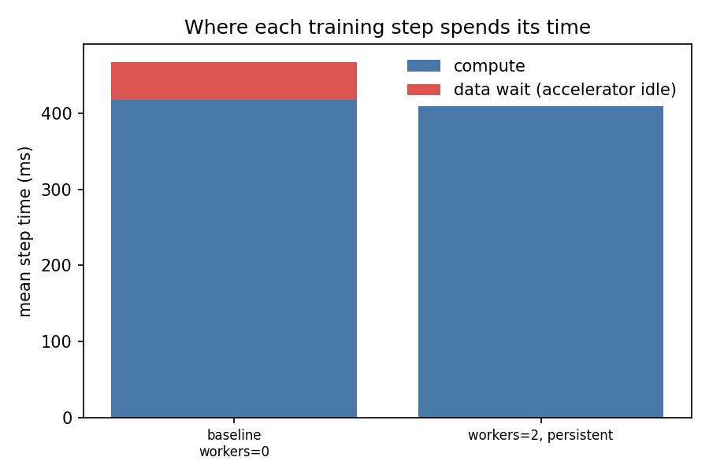

# loadtune report — resnet50_cifar10

*2026-06-12 16:14 · device `mps` · 10 CPUs · brain `heuristic`*

## Diagnosis

The input pipeline is mildly contended (data wait 11%). Mean CPU utilisation during the run was 14.7%.

## Baseline

- config: `workers=0`
- throughput: **68.4 samples/s**
- data wait: 10.8% of step time (2.52s of 23.38s over 50 steps)
- step time p50/p90: 467.3 / 472.5 ms
- dataloader startup: 0.00s

## Trials

| config | throughput (samples/s) | vs baseline | data wait | proposed because |
|---|---|---|---|---|
| `workers=2, persistent` | 78.2 | 1.14x | 0.1% | mild data wait (11%): nudge workers to 2 |

## Charts

## Verdict

**Recommended config: `workers=2, persistent` — 1.14x baseline throughput** (68.4 → 78.2 samples/s).
