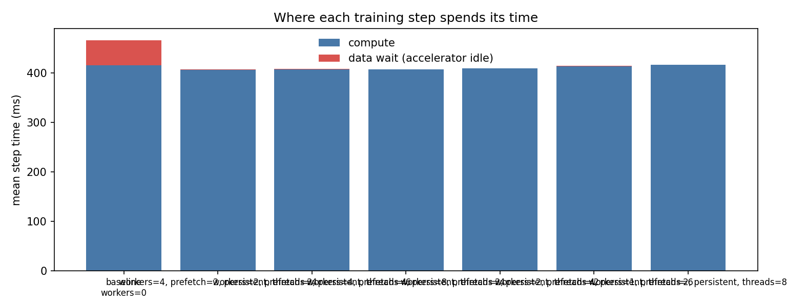
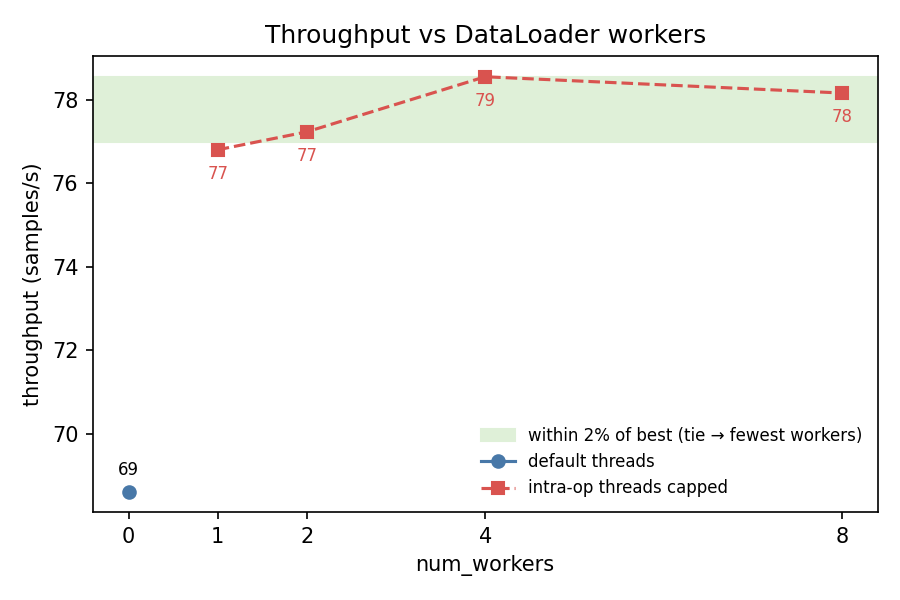
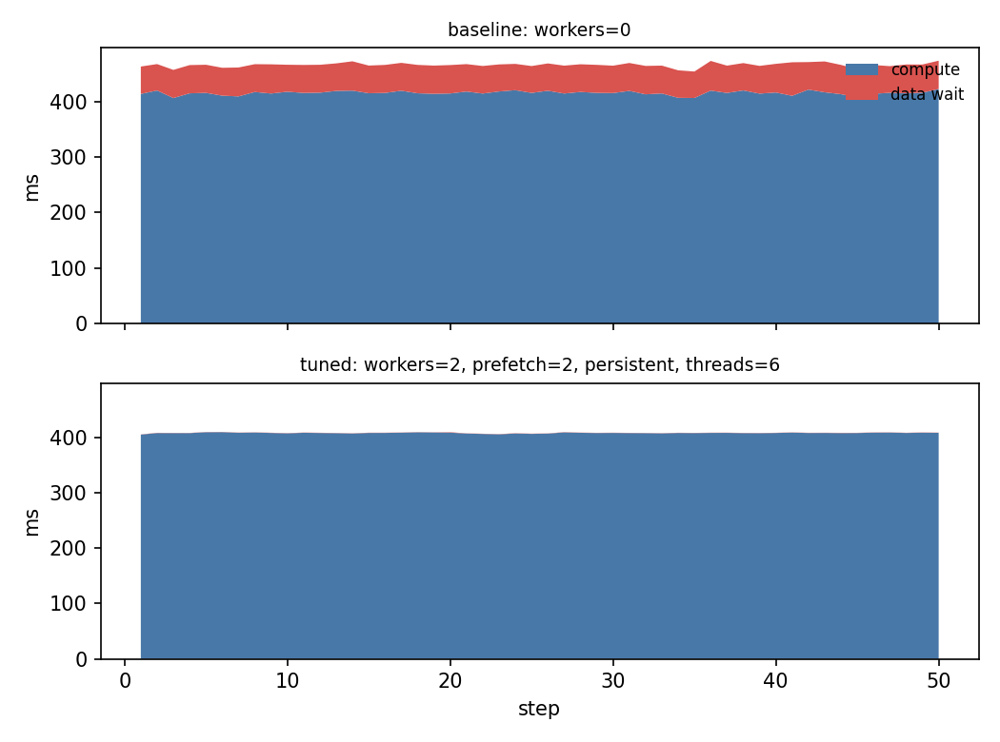

# loadtune report — resnet50_cifar10

*2026-06-12 17:45 · device `mps` · 10 CPUs · brain `llm`*

## Diagnosis

The baseline runs with num_workers=0 (single-process loading), contributing ~10.9% data wait time (~50ms per step). CPU utilization is very low at 9%, indicating the main process is bottlenecked on serial data loading. Since the device is MPS (unified memory), pin_memory is a no-op, but adding background workers should overlap data loading with MPS compute.

## Baseline

- config: `workers=0`
- throughput: **68.6 samples/s**
- data wait: 10.9% of step time (2.53s of 23.32s over 50 steps)
- step time p50/p90: 466.5 / 471.5 ms
- dataloader startup: 0.00s

## Trials

| config | throughput (samples/s) | vs baseline | data wait | proposed because |
|---|---|---|---|---|
| `workers=4, prefetch=2, persistent, threads=4` | 78.6 | 1.15x | 0.1% | 4 workers should fully overlap CIFAR-10 loading with MPS compute. persistent_workers avoids re-spawn overhead between epochs. num_threads capped at 4 to avoid competing with the 4 workers for CPU cores. |
| `workers=2, prefetch=2, persistent, threads=6` | 78.4 | 1.14x | 0.1% | 2 workers is a lighter configuration that may suffice to hide the ~50ms data wait while leaving more CPU bandwidth for MPS-side operations. More threads available for compute. |
| `workers=4, prefetch=4, persistent, threads=4` | 78.5 | 1.14x | 0.1% | Higher prefetch_factor (4) gives a deeper pipeline buffer, which can better hide any bursty loading latency seen in the p90 step times. |
| `workers=8, prefetch=2, persistent, threads=2` | 78.2 | 1.14x | 0.1% | 8 workers maximises parallelism for data loading on this 10-core machine. num_threads reduced to 2 to prevent CPU contention between workers and main-process intra-op threads. |
| `workers=2, prefetch=4, persistent, threads=6` | 77.2 | 1.13x | 0.1% | 2 workers with deeper prefetch (4) tries to keep the pipeline full with fewer processes, reducing IPC overhead while still hiding data latency. |
| `workers=1, prefetch=2, persistent, threads=8` | 76.8 | 1.12x | 0.2% | Minimal worker count to test whether even a single background worker eliminates the data wait, while keeping most cores free for the main process intra-op threads. |

## Charts

## Verdict

**Recommended config: `workers=2, prefetch=2, persistent, threads=6` — 1.14x baseline throughput** (68.6 → 78.4 samples/s).
