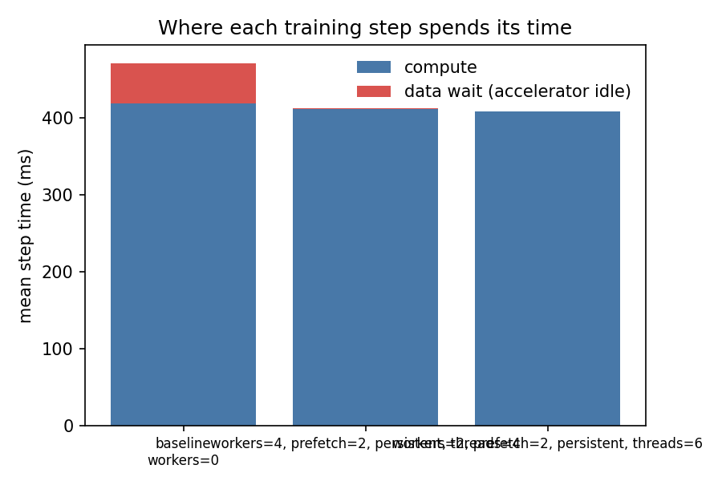
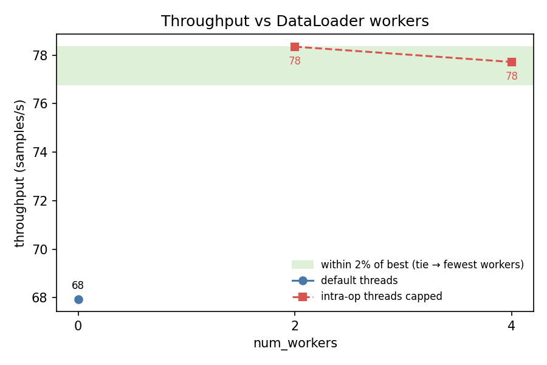
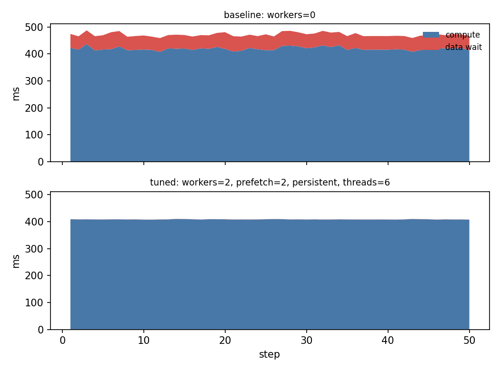

# loadtune report — resnet50_cifar10

*2026-06-12 18:16 · device `mps` · 10 CPUs · brain `llm`*

## Diagnosis

Data wait is only 11% of total time, meaning compute dominates and the input pipeline ceiling is ~1.12x. The main process is loading data (num_workers=0) with low CPU utilization (13.2%), and on MPS pin_memory is a no-op. A small number of workers with prefetching may absorb the modest data stall, but gains will be limited.

## Baseline

- config: `workers=0`
- throughput: **67.9 samples/s**
- data wait: 11.1% of step time (2.61s of 23.55s over 50 steps)
- step time p50/p90: 469.2 / 484.2 ms
- dataloader startup: 0.00s

## Trials

| config | throughput (samples/s) | vs baseline | data wait | proposed because |
|---|---|---|---|---|
| `workers=4, prefetch=2, persistent, threads=4` | 77.7 | 1.14x | 0.1% | 4 workers should overlap data loading with compute to eliminate the ~11% data wait. persistent_workers avoids re-spawning overhead between epochs. num_threads capped at 4 to avoid CPU contention with workers. Best single trial to claim the available headroom. |
| `workers=2, prefetch=2, persistent, threads=6` | 78.3 | 1.15x | 0.1% | Lighter worker count (2) in case 4 workers introduces spawn/IPC overhead that outweighs benefits given the small data-wait fraction. More threads left for compute. |

## Charts

## Verdict

**Recommended config: `workers=2, prefetch=2, persistent, threads=6` — 1.15x baseline throughput** (67.9 → 78.3 samples/s).
