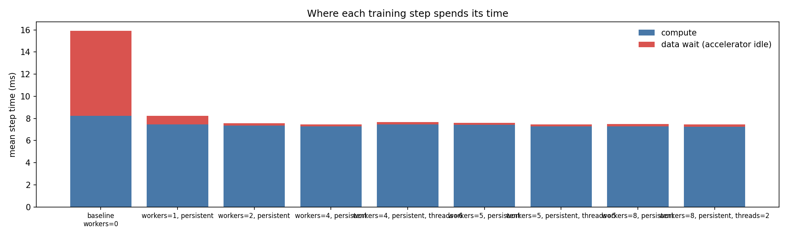
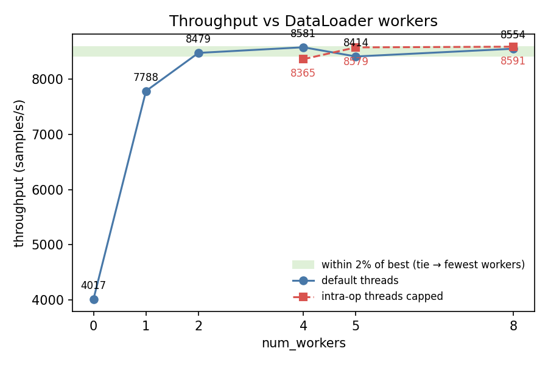
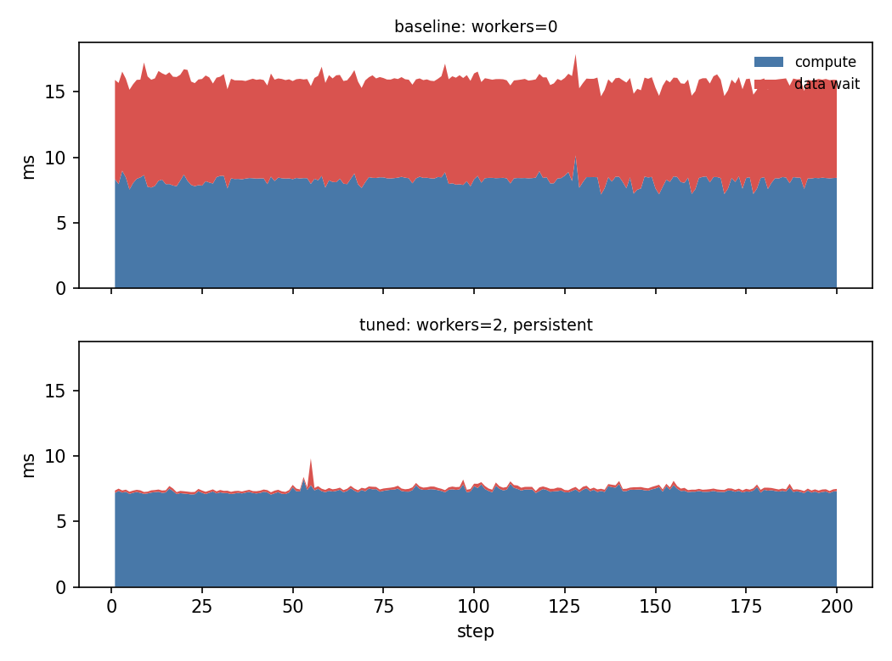

# loadtune report — synthetic_bottleneck

*2026-06-12 17:01 · device `mps` · 10 CPUs · brain `heuristic`*

## Diagnosis

The workload is **input-bound**: 48% of step time is spent waiting for the DataLoader. Mean CPU utilisation during the run was 7.2%.

## Baseline

- config: `workers=0`
- throughput: **4017.2 samples/s** (median of 3, 3908.3–4048.9)
- data wait: 48.3% of step time (1.54s of 3.19s over 200 steps)
- step time p50/p90: 16.0 / 16.3 ms
- dataloader startup: 0.00s

## Trials

| config | throughput (samples/s) | vs baseline | data wait | proposed because |
|---|---|---|---|---|
| `workers=1, persistent` | 7788.1 (7777.2–7820.0) | 1.94x | 9.3% | data_wait_frac=48% ≥ 20%: input-bound, trying num_workers=1 |
| `workers=2, persistent` | 8478.9 (8471.5–8583.2) | 2.11x | 2.6% | data_wait_frac=48% ≥ 20%: input-bound, trying num_workers=2 |
| `workers=4, persistent` | 8581.0 (8576.4–8627.9) | 2.14x | 2.6% | data_wait_frac=48% ≥ 20%: input-bound, trying num_workers=4 |
| `workers=4, persistent, threads=6` | 8365.1 (8253.1–8661.8) | 2.08x | 2.6% | workers=4 claim cores: cap intra-op threads at 6 to avoid contention |
| `workers=5, persistent` | 8413.8 (8335.0–8436.6) | 2.09x | 2.5% | data_wait_frac=48% ≥ 20%: input-bound, trying num_workers=5 |
| `workers=5, persistent, threads=5` | 8578.7 (8468.0–8596.3) | 2.14x | 2.5% | workers=5 claim cores: cap intra-op threads at 5 to avoid contention |
| `workers=8, persistent` | 8553.9 (8258.9–8593.4) | 2.13x | 2.7% | data_wait_frac=48% ≥ 20%: input-bound, trying num_workers=8 |
| `workers=8, persistent, threads=2` | 8591.4 (8394.7–8606.7) | 2.14x | 2.5% | workers=8 claim cores: cap intra-op threads at 2 to avoid contention |

## Charts

## Verdict

**Recommended config: `workers=2, persistent` — 2.11x baseline throughput** (4017.2 → 8478.9 samples/s).
