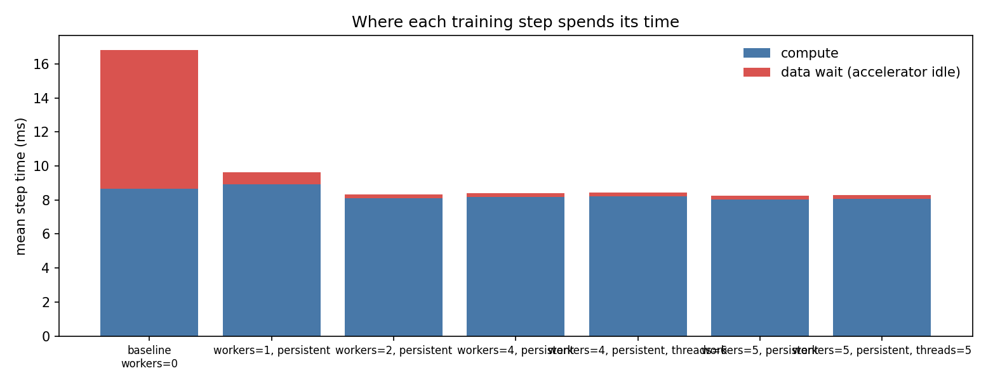
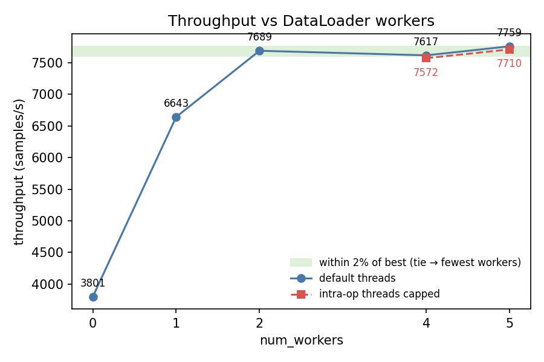
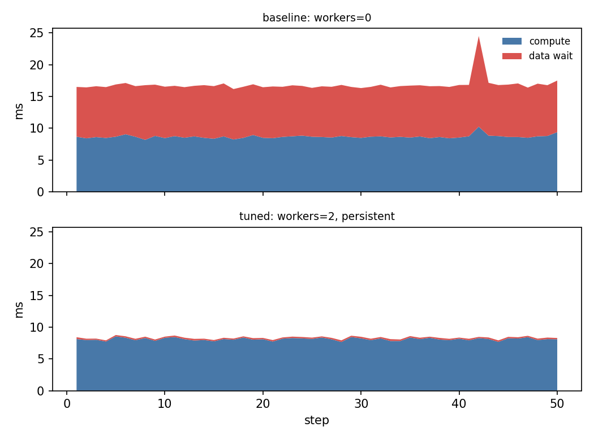

# loadtune report — synthetic_bottleneck

*2026-06-17 15:31 · device `mps` · 10 CPUs · brain `heuristic`*

## Diagnosis

The workload is **input-bound**: 49% of step time is spent waiting for the DataLoader. Mean CPU utilisation during the run was 15.7%.

## Baseline

- config: `workers=0`
- throughput: **3800.8 samples/s**
- data wait: 48.6% of step time (0.41s of 0.84s over 50 steps)
- step time p50/p90: 16.6 / 17.1 ms
- dataloader startup: 0.00s

## Trials

| config | throughput (samples/s) | vs baseline | data wait | proposed because |
|---|---|---|---|---|
| `workers=1, persistent` | 6642.6 | 1.75x | 7.4% | data_wait_frac=49% ≥ 20%: input-bound, trying num_workers=1 |
| `workers=2, persistent` | 7689.0 | 2.02x | 2.6% | data_wait_frac=49% ≥ 20%: input-bound, trying num_workers=2 |
| `workers=4, persistent` | 7616.7 | 2.00x | 2.9% | data_wait_frac=49% ≥ 20%: input-bound, trying num_workers=4 |
| `workers=4, persistent, threads=6` | 7571.9 | 1.99x | 2.8% | workers=4 claim cores: cap intra-op threads at 6 to avoid contention |
| `workers=5, persistent` | 7759.4 | 2.04x | 2.8% | data_wait_frac=49% ≥ 20%: input-bound, trying num_workers=5 |
| `workers=5, persistent, threads=5` | 7710.1 | 2.03x | 2.7% | workers=5 claim cores: cap intra-op threads at 5 to avoid contention |

## Charts

## Verdict

**Recommended config: `workers=2, persistent` — 2.02x baseline throughput** (3800.8 → 7689.0 samples/s).
